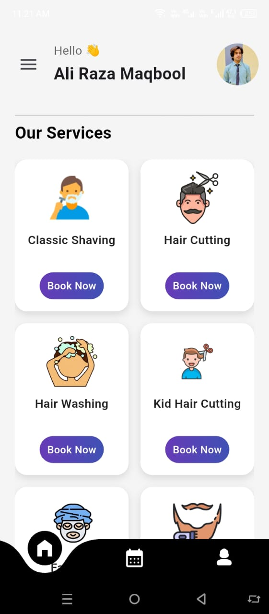
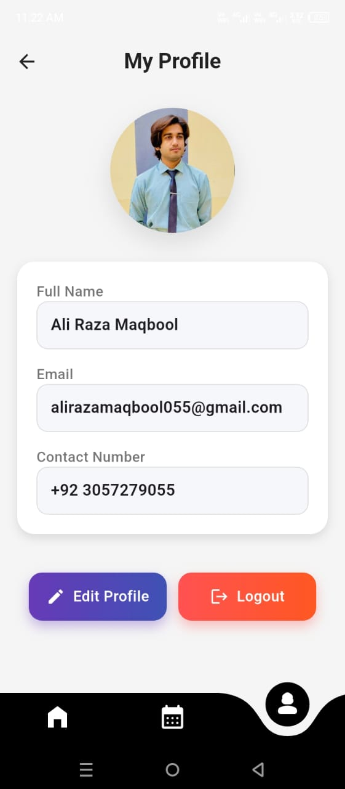
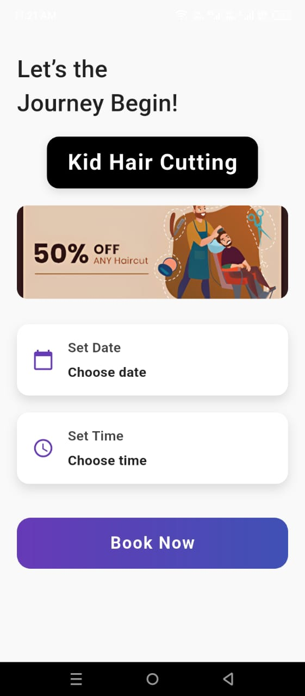

# 💈 Barber Shop App (Flutter + Firebase + Cloudinary)

A modern barber shop app built using **Flutter**, **Firebase Authentication**, **Firestore**, and **Cloudinary** for image uploads. This project demonstrates a fully functional service booking system with user authentication and admin-level order tracking.

---

## ✨ Features

- 🔐 Firebase Authentication (Login/Signup)
- 📸 Profile Picture Upload (via Cloudinary)
- 🏠 Modern Home Page with Service Cards
- 📋 Service Detail Page with Booking Option
- 📦 Firestore Integration for Orders
- 🧑‍💼 Admin Panel to View and Manage Orders
- 🧭 Real-time Data Updates with Streams
- 🎨 Clean and Stylish UI

---

## 🛠️ Tech Stack

| Feature            | Tech Used                         |
|--------------------|----------------------------------|
| Frontend           | Flutter (Dart)                   |
| Authentication     | Firebase Authentication          |
| Database           | Firebase Firestore               |
| Image Hosting      | Cloudinary                       |
| State Management   | `setState` / Firebase Streams    |
| UI Components      | Material Design, Custom Widgets  |

---
## 📸 App Screenshots

### 🏠 Home Page


### 👤 Profile Page


### ✂️ Booking Page



## 📦 Installation

1. **Clone the repository**
   ```bash
   git clone https://github.com/aliraza055/barber-shop-app.git
   cd barber-shop-app

